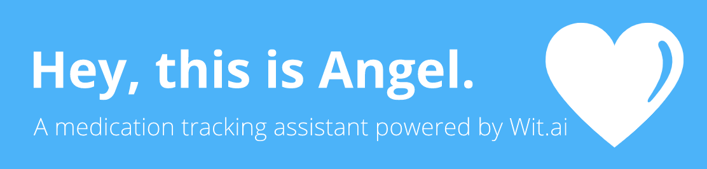

&nbsp;
&nbsp;

<!--  -->

# Angel Assistant

Angel is an intelligent medication tracking assistant powered by [Wit.ai](https://wit.ai/). This project was submitted to the [Facebook Artificial Intelligence Hackathon](https://fbai2.devpost.com/) and [Facebook Messaging Hackathon](https://fbai2.devpost.com/).

Want to use Angel Assistant? Start a conversation by messaging at https://facebook.com/angelassistantai.

Our project website is https://angelassistant.tech/.

## Inspiration

Keeping track of personal medications is challenging for many people. According to a review in Annals of Internal Medicine, “studies have shown that 20 percent to 30 percent of medication prescriptions are never filled, and that approximately 50 percent of medications for chronic disease are not taken as prescribed.” This lack of adherence is estimated to cause approximately 125,000 deaths and at least 10 percent of hospitalizations, and to cost the American health care system between $100 billion and $289 billion a year.

Our team was determined to leverage the power of Wit.ai to build a well-designed and easy-to-use chatbot interface that assists people with remembering and keeping tracking of their medications, in an effort to encourage people to stay on top of their medications and remember to take them as prescribed. Angel Assistant supports a simple and accessible way for users to communicate via natural language and stay on top of their medications, which is possible through the cutting-edge infrastructure and technology of Wit.ai.

## What it does

Angel is an intelligent chatbot that allows users to quickly add, track, and remember their medications. Users can add medications via voice commands, specifying the name of the medicine, dosage, and times. They can update their status by leaving a quick voice or text message, after which Angel will give timely reminders. Lastly, Angel provides each patient with a unique ID, which they can then share with their doctors for them to monitor their patients’ progress, and send messages accordingly.

## How we built it

Angel lives in a Python based cloud server hosted on Azure. We are using Flask for the cloud server and MongoDB Atlas for our database. We are using the Facebook developer infrastructure to integrate the Angel Assistant backend with Messenger for automated intelligent messaging.

Incoming messages from Messenger get forwarded to the Angel backend server for processing. Messages are then sent to our Wit.ai application, which returns the intent, state and traits of the message, backed by the mongoDB database and our state machine. In this manner, we curate custom responses to the user based on their message, as well as update the database accordingly.

## Challenges we ran into (Need to change)

As mentioned above, the implementation of a chat bot's logic can become very complex very quickly. The major challenge we faced was dealing with that complexity in a way that allows more functionality to be added without increasing complexity exponentially. Another challenge we faced goes hand-in-hand: debugging complex, interwoven state can be difficult and time-consuming. Extensive logging and tracing really helped a lot here and is something to remember for the next project. Finally, we had to come up with a custom solution to support voice messages because Wit.ai does not natively support the voice message formats of Telegram/Messenger.

## Accomplishments that we're proud of

We were proud to have created a well-designed and well-executed Minimum Viable Prototype of an intelligent chat bot that successfully tracks medications, and implements various tracking features. The system integrates well with Messenger, and we strive to integrate it with other chat platforms as well in the future. Lastly, we are proud to have configured natural language interactions by enabling users to send custom voice messages.

## What we learned (Need to change)

Sometimes things that seem simple on the surface turn out to be much more difficult when observed in detail. The first few Wit.ai intents were quickly implemented (e.g. tell_joke and greeting), but the more complicated ones such as add_expense quickly lead to a state explosion that required us to change our approach from a direct implementation of the logic to an indirect solution through a state machine. We also learned that it is a good idea to keep things more generic from the start in order to be able to support multiple back-ends (Messenger/Telegram) without excessive refactoring sessions.

## What's next for Angel Assistant

Currently, Angel Assistant is designed and published as a Minimum Viable Product. We would like to refine the functionality, taking into consideration feedback from users and experts in the healthcare field. A feature we would especially like to implement is support for finding and showing further information on various medications, as well as integrating with pharmacy systems for online purchases of medications.

## References

https://www.nytimes.com/2017/04/17/well/the-cost-of-not-taking-your-medicine.html
https://pubmed.ncbi.nlm.nih.gov/22964778/

---

## Build Instructions

1. Set up your [Wit.ai](https://wit.ai/) and create [Messenger](https://developers.facebook.com/docs/messenger-platform/) bots to get your access keys.

2. Install Python and Flask via pip, and and update the access keys for the bot.

3. Start the ngrok server by running server.py.

4. Test using messenger

5. Alternatively, message https://facebook.com/angelassistantai to start chatting now!
